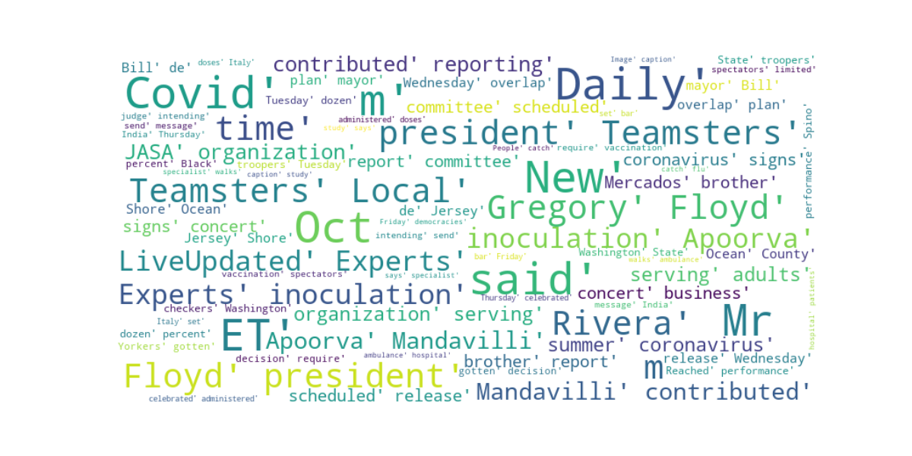

# hw-5

Hello, for this assignment I followed Gilvandro Neto's [tutorial](https://medium.com/analytics-vidhya/extracting-keywords-from-covid-19-news-with-python-13249571d37b) on extracting keywords from Covid-19 news sites using Python.

## Output

The final DataFrame is output to a csv file [here](output.csv).

Also, a Word Cloud is genereated using the most frequent key words.

